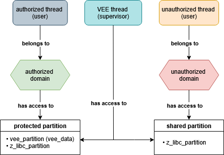
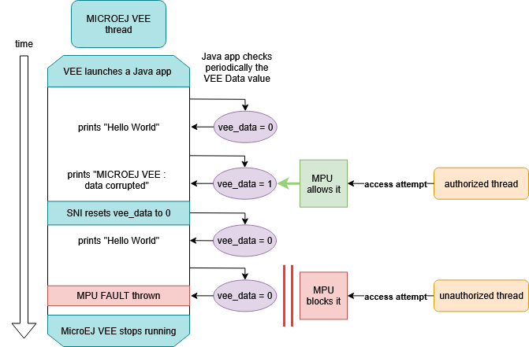

# Overview

**MicroEJ Demonstration** : `Memory Protection Unit (MPU) example on Zephyr VEE Port [1.0.0]`

The main goal of this project is to demonstrate how the ARM Memory Protection Unit (MPU) can be used to secure the memory of a MICROEJ VEE Port running on Zephyr RTOS.

The MPU is an optional component in Cortex-M processor systems. In systems that require high reliability, the MPU can protect memory regions by defining access permissions for different privilege states. Refer to [this documentation](https://developer.arm.com/documentation/107565/0101/Memory-protection/Memory-Protection-Unit) for more information. 

In real-world use cases, when third-party native code runs in parallel with the MICROEJ VEE, it can accidentally (or intentionally) corrupt the memory used by the MICROEJ VEE runtime. The MPU provides hardware-based memory isolation to prevent such corruption.

This demonstration shows :
- How the MPU separates memory access rights between threads.
- How to share memory safely between the MICROEJ VEE and trusted native threads.
- What happens when unauthorized native code tries to access protected memory.

## Features

- Isolation of MICROEJ VEE memory from untrusted native thread with the MPU.
- Safe data sharing between MICROEJ VEE and authorized thread.
- Controlled corruption scenario to visualize the protection mechanism.
- Integration with Zephyr RTOS memory partitions and domains.

## VEE Port Information

The architecture version is `8.4.0`.

| Foundation Library | Version |
|--------------------|---------|
| EDC                | 1.4     |

The project contains the following subprojects:

- `vee-port` : Contains the VEE Port configuration description.
  Some modules are described in a specific sub-folder / with some optional configuration files
  (`.properties` and / or `.xml`).

- `zephyr-bsp` : Contains a ready-to-use Zephyr Abstraction Layer implementing the MPU, including a cmake project and
  an implementation of MicroEJ Core Engine (and extensions) port on Zephyr.

- `app` : Contains a simple Java application which uses the VEE Port that demonstrates the data protection of the MPU 

By default, the VEE Port is configured as a Mono-Sandbox Evaluation VEE Port. 

This VEE Port is meant to run only on a board. It won't work on a simulator as there is no frontpanel.

## System Architecture



The demonstration is based on three native threads:

1. Authorized Native Thread
    * Runs in user mode.
    * Has access to the `vee_partition` containing `vee_data` a variable shared with the MICROEJ VEE.
    * Can intentionally corrupt `vee_data`.

2. MICROEJ VEE Thread
    * Runs in supervisor mode.
    * Has unrestricted memory access.
    * Executes the Java application.

3. Unauthorized Native Thread
    * Runs in user mode.
    * Does not have access to `vee_data` through the `shared partition` it belongs to.
    * Any attempt to modify `vee_data` triggers an `MPU FAULT`.

## Demonstration Workflow



1. The MICROEJ VEE thread starts and periodically prints while `vee_data = 0` :
```
MICROEJ VEE : Hello World from Java
```

2. The Authorized Thread starts and corrupts the `vee_data` variable by setting it to 1. The MICROEJ VEE detects the corruption and prints :
```
MICROEJ VEE : Data corrupted
```

3. The `vee_data` variable is reseted to its original value and the MICROEJ VEE thread restarts and periodically prints :
```
MICROEJ VEE : Hello World from Java
```

4. The Unauthorized Thread starts and attempts to corrupt `vee_data`. This triggers an `MPU FAULT` halting the system :
```
***** MPU FAULT *****
Data Access Violation
```

# Requirements

- PC with either Windows with Linux or Windows installed.
- Internet connection to [MicroEJ Central Repository](https://developer.microej.com/central-repository/)
- [MicroEJ SDK6](https://docs.microej.com/en/latest/SDK6UserGuide/install.html#installation)
- An i.MX RT1170 Evaluation Kit board (can be ordered [here](https://www.nxp.com/design/design-center/development-boards-and-designs/i-mx-evaluation-and-development-boards/i-mx-rt1170-evaluation-kit:MIMXRT1170-EVKB)).

# Usage

This sections explains how to set up everything needed to run the demonstration, including the software installation and the environment variables configuration.

## 1- Software Installation

To run the demonstration, install the following softwares :
- [Zephyr 4.1.0](https://docs.zephyrproject.org/latest/develop/getting_started/index.html#)
- [LinkServer](https://www.nxp.com/design/design-center/software/development-software/mcuxpresso-software-and-tools-/linkserver-for-microcontrollers:LINKERSERVER) or [J-Link](https://www.segger.com/downloads/jlink/)

## 2- Environment Variables Configuration 

Whatever procedure is used for the installation, the following environment variables must be configured:
- `ZEPHYR_BASE` : forces CMake to use the Zephyr installation made during the [Zephyr Getting Started](https://docs.zephyrproject.org/latest/develop/getting_started/index.html#get-zephyr-and-install-python-dependencies), for example `C:\Users\username\zephyrproject\zephyr`.
- If you use LinkServer to flash your device, add to `PATH` the installation directory of LinkServer, for example `C:\NXP\LinkServer_24.12.21`.
- If you use J-Link to flash your device, add to `PATH` the installation directory of LinkServer, for example `C:\Program Files\SEGGER\JLink_V834`.

## 3- How to run 

### On Simulator

N/A

### On Device

This section shows how to build the whole project including the `bsp` and the application.

By default LinkServer is used as a debug probe. To change this behaviour modify the value of `CHOSEN_PROBE` in the [set_project_env.bat](zephyr-bsp/vee/scripts/set_project_env.bat) file. 

Go inside the `mpu` folder and run the following command using a terminal (or click the Play button next to the line below when opening this README in IntelliJ IDEA):

```
./gradlew :app:runOnDevice
```

Alternative ways to run on device are described in the [Run on Device](https://docs.microej.com/en/latest/SDK6UserGuide/runOnDevice.html) documentation.

## Expected results

Firstly, the native threads that will corrupt the MICROEJ VEE data and the MICROEJ VEE thread are created and configured without being launched. Those operations are refering to the following output in the console :
```
AUTHORIZED NATIVE THREAD created

z_libc_partition partition added to Authorized memory domain

MicroEJ VEE partition added to Authorized memory domain

AUTHORIZED NATIVE THREAD added to authorized memory domain

UNAUTHORIZED NATIVE THREAD created

z_libc_partition partition added to Unauthorized memory domain

UNAUTHORIZED NATIVE THREAD added to unauthorized memory domain

MICROEJ VEE thread created
```
It creates and configures the MPU, memory partitions/domains and execution mode of the threads. 

The authorized and unauthorized threads are set to user mode. This mode grants them access to their stack and memory partitions contained in their memory domain. In the end :
- The authorized thread has access to the `z_libc_partition` and the MICROEJ VEE partition containing the MICROEJ VEE data.
- The unauthorized thread has only access to the `z_libc_partition`.

The MICROEJ VEE thread is set to supervisor mode which means that he has access to any memory he needs without restrictions.

Then, the MICROEJ VEE starts:
```
MICROEJ VEE thread started

MicroEJ START
```
The Application prints `VEE : Hello World from Java` a few times in the console while the `vee_data` is not corrupted :
```
MICROEJ VEE : Hello World from Java
```
The authorized thread that has access to the `vee_data` starts and corrupts this variable. The Application prints :
```
AUTHORIZED NATIVE THREAD that corrupts VEE data started

MICROEJ VEE : Data corrupted
```
In fact, this behaviour is normal as this authorized thread has access to the MICROEJ VEE data because the memory partition containing the MICROEJ VEE data was added to this thread's memory domain.

Then `resetVeeData` is called and the Java app starts printing `VEE : Hello World from Java` again. `resetVeeData` is a SNI that resets the `vee_data` to it's original value after a corruption :
```
MICROEJ VEE : Hello World from Java
```
The unauthorized thread that does not have access to the `vee_data` starts and corrupts it. As a consequence the The `MPU_FAULT` is thrown :
```
UNAUTHORIZED NATIVE THREAD that corrupts MICROEJ VEE data started

[00:00:08.050,000] [1B][1;31m<err> os: ***** MPU FAULT *****[1B][0m
[00:00:08.050,000] [1B][1;31m<err> os:   Data Access Violation[1B][0m
[00:00:08.050,000] [1B][1;31m<err> os:   MMFAR Address: 0x80001000[1B][0m
[00:00:08.050,000] [1B][1;31m<err> os: r0/a1:  0x00000000  r1/a2:  0x00000000  r2/a3:  0x00000001[1B][0m
[00:00:08.050,000] [1B][1;31m<err> os: r3/a4:  0x80001000 r12/ip:  0x3002cd13 r14/lr:  0x3002cd1f[1B][0m
[00:00:08.050,000] [1B][1;31m<err> os:  xpsr:  0x21000000[1B][0m
[00:00:08.050,000] [1B][1;31m<err> os: s[ 0]:  0x00000000  s[ 1]:  0x300066c1  s[ 2]:  0xaaaaa2ab  s[ 3]:  0xaaaaa8aa[1B][0m
[00:00:08.050,000] [1B][1;31m<err> os: s[ 4]:  0x00000000  s[ 5]:  0x00000000  s[ 6]:  0x00000000  s[ 7]:  0x00000000[1B][0m
[00:00:08.050,000] [1B][1;31m<err> os: s[ 8]:  0x00000000  s[ 9]:  0x00000000  s[10]:  0x00000000  s[11]:  0x00000000[1B][0m
[00:00:08.050,000] [1B][1;31m<err> os: s[12]:  0x00000000  s[13]:  0x00000000  s[14]:  0x00000000  s[15]:  0x00000000[1B][0m
[00:00:08.050,000] [1B][1;31m<err> os: fpscr:  0x00000000[1B][0m
[00:00:08.050,000] [1B][1;31m<err> os: Faulting instruction address (r15/pc): 0x300066c4[1B][0m
[00:00:08.050,000] [1B][1;31m<err> os: >>> ZEPHYR FATAL ERROR 19: Unknown error on CPU 0[1B][0m
[00:00:08.050,000] [1B][1;31m<err> os: Current thread: 0x80001718 (UNAUTHORIZED NATIVE THREAD)[1B][0m
[00:00:08.077,000] [1B][1;31m<err> os: Halting system[1B][0m
```
This behaviour is due to the fact that the memory domain of this unauthorized thread does not include the MICROEJ VEE memory partition.

## Code explanation

### Zephyr

The [main.c](zephyr-bsp/vee/src/main.c) file contains the Zephyr C code creating the various threads and MPU configurations. Here are the main elements of the code to undesrtand :

- `K_APPMEM_PARTITION_DEFINE(vee_partition)` and `K_APP_DMEM(vee_partition) volatile bool vee_data = false` creates a memory partition containing a variable used by the Java app to run.

- `create_authorized_thread()` creates a thread that has access to the memory partition containing the data used by the MICROEJ VEE :
  - `k_thread_create` creates the thread.
  - `k_mem_domain_init` initializes a memory domain containing the `vee_partition` and `z_libc_partition` memory partitions. `z_libc_partition` contains globals required by the C library and runtime. Required when using either the Minimal C library or the Newlib C Library. 
  - `k_mem_domain_add_thread` adds the created thread to the previously created memory domain.

- `create_unauthorized_thread()` creates a thread that does not have the right to access to the memory partition containing the data used by the MICROEJ VEE. It works exactly in the same way as the previous one excpeted than `k_mem_domain_init` initializes a memory domain containing only the `z_libc_partition` memory partition. This is the reason why this thread does not have access to the MICROEJ VEE data.

Both of those threads are launched in user mode. Which means that they have only access to their own memory stacks. That's why `z_libc_partition` is added to their memory domain so they use C library code.

- The `main` then launches the previously created thread in the folloowing order :
  1. MICROEJ VEE thread
  2. Authorized thread that has access to the MICROEJ VEE data
  3. Unauthorized thread that does not have access to the MICROEJ VEE data

The [prj.conf](mpu/zephyr-bsp/vee/prj.conf) file is a Kconfig fragment configuring the software features and the MPU for the application to run.

### MicroEJ Application 

The [Main.java](app/src/main/java/com/microej/example/mpu/Main.java) file is a simple Java app that prints a `VEE : Hello World from Java` log message while it's data is not corrupted.

The data is represented as a variable called `vee_data` declared in the [main.c](zephyr-bsp/vee/src/main.c) file. It is accessed by the Java code threw the `getVeeData` native method.  

When this variable is corrupted by a third party thread the `VEE : Data corrupted` message is printed in the console.

`resetVeeData` is a SNI that resets the `vee_data` to it's original value after a corruption.

# Dependencies

All dependencies are retrieved transitively by Gradle.

# Source

N/A

# Restrictions 

This demonstration is only designed to run on hardware (no simulation support).

# Copyright

_Markdown_  
_Copyright 2024-2025 MicroEJ Corp. All rights reserved._  
_Use of this source code is governed by a BSD-style license that can be found with this software._ 
