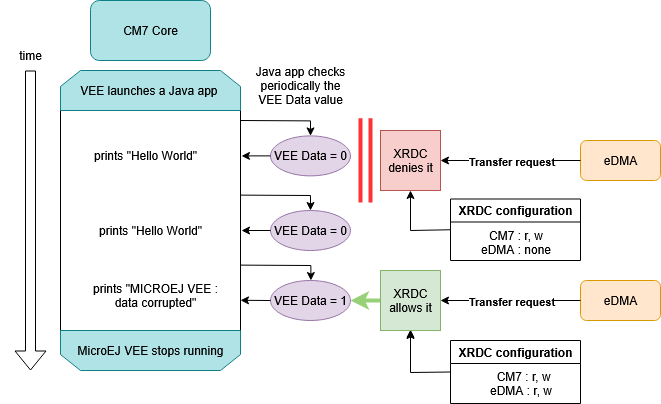

# Overview 

**MicroEJ Demonstration** : `Extended Resource Domain Controller 2 (XRDC2) protection on FreeRTOS VEE Port [1.0.0]`

The main goal of this project is to demonstrate how the Extended Resource Domain Controller 2 (XRDC2) protects the memory of a MICROEJ VEE Port running on FreeRTOS against corruption caused by an Enhanced Direct Memory Access (eDMA) transfer.

The XRDC2 provides an integrated, scalable architectural framework for access control, system memory protection, and peripheral isolation. It allows software to assign chip resources, including processor cores, non-core bus masters, memory regions, and slave peripherals to processing domains to support the enforcement of robust operational environments. 

The eDMA controller is a second-generation module capable of performing complex data transfers with minimal intervention from a host processor.

This demonstration shows :
- How XRDC2 assigns domain IDs to bus masters.
- How access control policies are dynamically updated at runtime.
- What happens when eDMA is denied vs granted access to MICROEJ VEE memory.

## Features

- Isolation of MICROEJ VEE memory from untrusted DMA accesses.
- Dynamic reconfiguration of XRDC2 access policies.
- Controlled eDMA transfers to demonstrate both blocked and allowed memory corruption.
- Detection of memory corruption at the Java application level.

## System Architecture

This XRDC2 demonstration involves three main components :

1. MICROEJ VEE Task
    * Runs on the Cortex-M7 core.
    * Executes the Java application.
    * Accesses a variable `vee_data` stored in a protected memory region.

2. eDMA Controller
    * Acts as a second bus master.
    * Attempts to transfer data into the MICROEJ VEE memory region.
    * Its access is either blocked or allowed by XRDC2.

3. XRDC2 Controller
    * Assigns domain IDs to CM7 and eDMA.
    * Defines access policies on memory regions.
    * Dynamically reconfigures memory permissions during the demo.


## Demonstration Workflow



1. Initialization
    - XRDC2 is initialized.
    - Domain IDs are assigned: CM7 (trusted), eDMA (restricted).
    - MICROEJ VEE memory region is initially accessible to CM7, inaccessible to eDMA.

2. MICROEJ VEE starts execution
    - Java app periodically prints :
```
MICROEJ VEE : Hello World from Java
MICROEJ VEE : Data value = false
```

3. First eDMA transfer (denied)
    - XRDC2 denies eDMA access according to the access policies described in the array below the diagram :

    

    

    - Transfer fails, memory remains intact.
    - MICROEJ VEE continues running normally.

4. Second eDMA transfer (allowed)
    - XRDC2 reconfigures policy to grant eDMA access.
    - eDMA successfully corrupts MICROEJ VEE data.
    - Application detects corruption and stops :
```
MICROEJ VEE : Data corrupted
MICROEJ VEE : Data value = true
```

# Requirements

* MICROEJ SDK 6.
* A PC with Windows 10 or higher or Linux.
* An i.MX RT1170 Evaluation Kit board (can be ordered [here](https://www.nxp.com/design/design-center/development-boards-and-designs/i-mx-evaluation-and-development-boards/i-mx-rt1170-evaluation-kit:MIMXRT1170-EVKB)).

this example has been tested on :
* IntelliJ IDEA 2023.3.3.
* NXPVEE-MIMXRT1170-EVK v3.0.0.

# Usage

This sections explains how to set up everything needed to run the demonstration on the NXP i.MX RT1170 EVK board.

## Preliminary Steps

This section shows the preliminary steps to take before running the sample.

1. Run this command to update the submodules : `git submodule update --init --recursive`. The initialized submodule provides the MICROEJ VEE Port for the i.MX RT1170 Evaluation Kit. It includes the board support package (based on MCUXpresso SDK and FreeRTOS), the drivers, and the VEE Port libraries needed to run Java applications on the hardware.
2. Run `cd xrdc/nxpvee-mimxrt1170-evk/` and run this command to initialize the dependencies : `west init -l .`.
3. Run `west update` to finish the initialisation of the dependencies.
4. Configure the environment for the VEE Port by referring to the `README.md` of the [i.MX RT1170 VEE Port](https://gitlab.cross/P0293_MIMXRT1170-EVK/P0293_MIMXRT1170-EVK), which is included as a submodule of this project. Do not follow the "Fetch the Source Code" section of the [i.MX RT1170 VEE Port README](https://gitlab.cross/P0293_MIMXRT1170-EVK/P0293_MIMXRT1170-EVK) as the sample code has been fetched thanks to the previous steps. Your environment is ready after the MicroEJ Mascot is visible on the screen of your board. 
5. Then run the command `./scripts/copy_files.bat` on Windows, or `./scripts/copy_files.sh` on Linux in the `xrdc` folder. Those scripts will copy the needed files for the XRDC sample in the VEE Port folder. 

## Run on Simulator

N/A

## Run on Device

This section shows how to build the whole project, including the `bsp` and the application.

In IntelliJ IDEA or Android Studio :
- Open the `app/SampleApplication` folder.
- Open the Gradle tool window by clicking on the elephant on the right side.
- Expand the `sample-application` list.
- Expand the `Tasks` list.
- From the `Tasks` list, expand the `microej` list.
- Double-click on `runOnDevice`.
- The executable is buil, and the device is flashed. Use the appropriate tool to retrieve the execution traces.

Otherwise, go inside the `xrdc/app/SampleApplication` folder by using a terminal and run the following command (or click the Play button next to the line below when opening this README in IntelliJ IDEA):
```
./gradlew runOnDevice
```

Alternative ways to run on the device are described in the [Run on Device](https://docs.microej.com/en/latest/SDK6UserGuide/runOnDevice.html) documentation.

## Expected results

First of all, the `Demo_Init_XRDC2()` function is called. It activates the XRDC2 and assigns XRDC Domain IDs to the eDMA and the Cortex-M7 Bus Masters. At this point, the XRDC configures the MICROEJ VEE memory region accessible by the CM7 and unaccessible by the eDMA. It also sets the MICROEJ VEE data variable stored at the memory address `DEST_ADDR` to 0 :
```
XRDC2/eDMA example started

XRDC access setting to the memory :
CM7		    r, w
eDMA		r, w
```
Then the task launching the MICROEJ VEE starts. The Java application running on the VEE Port begins to print `Hello World from Java`, and the value of the MICROEJ VEE data `Data value = false` :
```
NXP VEE Port i.MX RT1170 '3.0.0' '7ab8431d'
Chip revision: b0
Heap memory available: 447 KB
MicroEJ START
[main] INFO: MICROEJ VEE : Hello World from Java
[main] INFO: MICROEJ VEE : Data value = false
[main] INFO: MICROEJ VEE : Hello World from Java
[main] INFO: MICROEJ VEE : Data value = false
[main] INFO: MICROEJ VEE : Hello World from Java
[main] INFO: MICROEJ VEE : Data value = false
[main] INFO: MICROEJ VEE : Hello World from Java
[main] INFO: MICROEJ VEE : Data value = false
[main] INFO: MICROEJ VEE : Hello World from Java
[main] INFO: MICROEJ VEE : Data value = false
```
The application will not stop running and printing `Hello World from Java` while the MICROEJ VEE data is set to `false`.

After, ther XRDC2 configures the MICROEJ VEE memory region accessible by the CM7 and unaccessible by the eDMA :
```
XRDC access setting to the memory :
CM7		    r, w
eDMA		none
```
Right after this change of access policy, an eDMA transfer is launched to set the MICROEJ VEE data to `true` :
```
Destination Buffer:	0
eDMA memory to memory transfer example begin.

eDMA memory to memory transfer ongoing...
```
However, the eDMA access request to the MICROEJ VEE memory region is denied by the XRDC, so the MICROEJ VEE data remains at `false` :
```
eDMA memory to memory transfer did not finish.
Destination Buffer:	0

eDMA Channel 0 Status Flag = 0x00000002
 -> eDMA error flag, an error occurred in a transfer
 -> Error Status Flag = 0x80000001
 -> Destination bus error
```
As the MICROEJ VEE data was not corrupted by the previous eDMA transfer,  the Java application is still running :
```
[main] INFO: MICROEJ VEE : Hello World from Java
[main] INFO: MICROEJ VEE : Data value = false
[main] INFO: MICROEJ VEE : Hello World from Java
[main] INFO: MICROEJ VEE : Data value = false
[main] INFO: MICROEJ VEE : Hello World from Java
[main] INFO: MICROEJ VEE : Data value = false
[main] INFO: MICROEJ VEE : Hello World from Java
[main] INFO: MICROEJ VEE : Data value = false
[main] INFO: MICROEJ VEE : Hello World from Java
[main] INFO: MICROEJ VEE : Data value = false
```
The XRDC2 configures the MICROEJ VEE memory region accessible by the CM7 and the eDMA :
```
XRDC access setting to the memory :
CM7		    r, w
eDMA		r, w
```
A second eDMA transfer is launched to set the MICROEJ VEE data to `true`, and it succeeds :
```
Destination Buffer:	0
eDMA memory to memory transfer example begin.

eDMA memory to memory transfer ongoing...

eDMA memory to memory transfer finish.
Destination Buffer:	1

eDMA Channel 0 Status Flag = 0x00000001
 -> DONE flag, set while transfer finished, CITER value exhausted
```
In the end, the MICROEJ VEE data is considered as corrupted and the application running on the VEE Port logs `Data corrupted` and `Data value = true` before ending its execution :
```
[main] INFO: MICROEJ VEE : Data corrupted
[main] INFO: MICROEJ VEE : Data value = true
MicroEJ END (exit code = 0)

XRDC/eDMA example Success
```

## Code explanation

### MicroEJ Application 

The [Main.java](app/SampleApplication/src/main/java/com/microej/sampleapplication/Main.java) file is a simple Java app that prints a `VEE : Hello World from Java` log message while its data is not corrupted.

The data is located at the address stored in the variable `DEST_ADDR` defined in the [edma_xrdc_demo.h file](c/bsp/vee/src/bsp/edma_xrdc_demo.h). The Java code accesses it through the `getVeeData` native method.  

When this variable is corrupted by an eDMA transfer, the `MICROEJ VEE : Data corrupted` message is printed in the console.

### FreeRTOS

The [copy_files.bat](scripts/copy_files.bat) and [copy_files.sh](scripts/copy_files.sh) are respectively Windows and Linux scripts used to copy the files contained in the [c/bsp/vee](c/bsp/vee) directory to the `nxpvee-mimxrt1170-evk` VEE Port. The files copied are the [npavee.c](c/bsp/vee/src/main/npavee.c), [edma_xrdc_demo.c](c/bsp/vee/src/bsp/edma_xrdc_demo.c), and [edma_xrdc_demo.h](c/bsp/vee/src/bsp/edma_xrdc_demo.h) files. 

After running the copy script, the [npavee.c](c/bsp/vee/src/main/npavee.c) file replaces the [original npavee.c](https://gitlab.cross/P0293_MIMXRT1170-EVK/P0293_MIMXRT1170-EVK/-/blob/main/bsp/vee/src/main/npavee.c?ref_type=heads) file of the `nxpvee-mimxrt1170-evk` VEE Port. The copied `npavee.c` file only adds a few lines of code to launch the `demo_task_scheduler` task after the `microej_task` is launched. 

The `demo_task_scheduler(void)` function is defined in the [edma_xrdc_demo.c](c/bsp/vee/src/bsp/edma_xrdc_demo.c) and declared in the [edma_xrdc_demo.h](c/bsp/vee/src/bsp/edma_xrdc_demo.h) file, as well as all the code related to the eDMA/XRDC demonstration. 

Here are the main elements of the [edma_xrdc_demo.c](c/bsp/vee/src/bsp/edma_xrdc_demo.c) and [edma_xrdc_demo.h](c/bsp/vee/src/bsp/edma_xrdc_demo.h) code to understand :
* The `demo_task_scheduler(void)` function is launched as a task in the [npavee.c](c/bsp/vee/src/main/npavee.c) by the FreeRTOS `xTaskCreate` function call in parralel with the launch of the VEE Port task. It is the main function that orchestrates the demonstration because it launches the following subfunctions in this order : 
    1. `DEMO_Init_XRDC2()` that activates the XRDC2 & assigns XRDC Domain IDs to CM7 & eDMA Bus Masters. It assigns the domain by calling `DEMO_AssignDomainCM7()` and `DEMO_AssignDomainEDMA()`. It also sets the memory accessible by all of the Bus Masters thanks to `DEMO_SetAllMemAccessible`. 
    2. `DEMO_SetMemoryUnaccessible()` that configures the XRDC2 so the MICROEJ VEE memory region is accessible by the CM7 and unaccessible by the eDMA.
    3. `DEMO_MakeEDMATransfer()` that makes an eDMA transfer to corrupt the MICROEJ VEE memory. Note that **this eDMA access request to the MICROEJ VEE memory region is denied by the XRDC.** The handling of the eDMA Channel Status Flag is done by calling `DEMO_CheckEDMAStatusFlags(void)`.
    4. `DEMO_SetMemoryAccessible()` that configures the XRDC2 so the MICROEJ VEE memory region is accessible by the CM7 and the eDMA.
    5. `DEMO_MakeEDMATransfer()` that makes an eDMA transfer that corrupts the MICROEJ VEE memory. **This second eDMA access request to the MICROEJ VEE memory region is allowed by the XRDC**. As a result of this memory corruption, the Application running on the MicroEJ VEE crashes.
    6. `XRDC2_SetGlobalValid(DEMO_XRDC2, false)` and `XRDC2_Deinit(DEMO_XRDC2)` that deinitializes the XRDC2.

# Dependencies

All dependencies are retrieved transitively by Gradle.

# Source

N/A

# Restrictions 

This demonstration is only designed to run on hardware (no simulation support).

# Copyright

_Markdown_  
_Copyright 2025 MicroEJ Corp. All rights reserved._  
_Use of this source code is governed by a BSD-style license that can be found with this software._ 